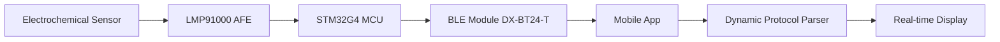

# Creasense - Smart Creatinine Monitoring App

> **Sense Your Creatinine** - Advanced cross-platform creatinine monitoring application

## 🎯 Overview

Creasense is a professional-grade mobile health application designed for real-time creatinine level monitoring through Bluetooth-enabled sensors. Built with modern technologies for precision, reliability, and seamless user experience.

## 🚀 Technology Stack

### **Frontend Architecture**
- **Vue 3** with Composition API - Modern reactive framework
- **TypeScript** - Full type safety and enhanced development experience  
- **Ionic 8** - Native-quality UI components
- **Vite 7** - Lightning-fast build tool
- **Capacitor 7** - Cross-platform native deployment

### **Mobile Platform**
- **iOS** (Primary) - Optimized for iPhone/iPad with native integrations
- **Android** (Planned) - Cross-platform compatibility
- **PWA Ready** - Progressive Web App capabilities

### **Core Technologies**
- **Bluetooth Low Energy (BLE)** - Real-time sensor communication
- **Chart.js** - Advanced data visualization
- **Pinia** - State management
- **i18n** - Multi-language support (EN, CN, JP, NL)

## 📡 Communication Protocol

### **Hardware-to-Software Data Pipeline**



### **Dynamic Protocol System**
- **Service UUID**: `0000fff0-0000-1000-8000-00805f9b34fb`
- **Characteristic UUID**: `0000fff1-0000-1000-8000-00805f9b34fb`
- **Protocol Versions**: V1 (12 bytes) with customizable support
- **Data Fields**: Sensor status, battery voltage, timestamp, current

### **Protocol Specifications**

**V1 Protocol (12 bytes)**
```json
{
  "protocolLength": 12,
  "flags": {
    "sensorStatus": "uint8",
    "batteryVoltage": "uint16_le",
    "timestamp": "uint32_le", 
    "current": "uint32_le"
  }
}
```

## 🛠 Development Setup

### **Prerequisites**
- Node.js 20.19.0+ or 22.12.0+
- iOS development tools (Xcode)
- Capacitor CLI

### **Installation**
```bash
# Install dependencies
npm install

# Development server
npm run dev

# iOS deployment
npm run cap:build:ios
```

### **Project Structure**
```
src/
├── components/          # Vue components
├── views/              # Page components  
├── services/           # Business logic
├── utils/              # Utility functions
├── types/              # TypeScript definitions
├── composables/        # Vue composables
└── styles/             # Global styles

public/
├── data/               # Protocol definitions
├── locales/           # Internationalization
└── assets/            # Static resources
```

## 🔧 Core Features

### **Real-time Monitoring**
- Live creatinine measurements via BLE
- State machine-driven connection management
- Error recovery and reconnection logic

### **Data Visualization**
- Interactive trend charts (daily/weekly/monthly)
- Real-time health status indicators
- Historical data analysis

### **Developer Tools**
- Protocol debugging interface
- Custom HEX data transmission
- Real-time packet analysis
- Device calibration utilities

### **Security & Privacy**
- Biometric authentication (Face ID)
- Local-only data storage
- Minimal privacy principle

## 🌐 Internationalization

Currently supported languages with complete localization:
- **English** (en)
- **Chinese Simplified** (zh-Hans)  
- **Chinese Traditional** (zh-Hant)
- **Japanese** (ja)
- **Dutch** (nl)

**Architecture Features:**
- JSON-based language resource files for easy maintenance
- Easy scalability for adding new languages

## 📱 Platform Compatibility

- **iOS 18.0+** - Primary platform with full feature set
- **Android 9.0+** - Cross-platform compatibility (planned)
- **Web Browsers** - Cross-platform compatibility (planned)

## 🚀 Innovation Highlights

1. **Dynamic Protocol Management** - Runtime protocol adaptation for firmware updates
2. **Developer-Friendly Debugging** - Comprehensive toolset for R&D collaboration
3. **Refined User Experience** - Thoughtful micro-interactions and optimizations for enhanced efficiency

---

**Built for you.**

---

## License

This project is licensed under the Apache License 2.0 - see the [LICENSE](LICENSE) file for details.